# ISS End-To-End Testing Workflow

This document is the full manual testing workflow for the ISS ERP system.

It is written for testers who need one guided path from system setup and master data creation through procurement, inventory, sales, finance, reporting, and month-end tie-out.

Use this guide when you want to answer all of these questions in one run:

- Can a fresh tester set up the system correctly?
- Do the main transactions post correctly?
- Do stock, AR, AP, and reports move as expected after each transaction?
- Do month-end balances and reports tally at the end?

This workflow is built on the current repository structure and complements these shorter documents:

- `docs/manual-uat-guide.md`
- `docs/user-manual.md`
- `docs/iss-tester-trainer-handbook.md`
- `docs/role-based-test-checklists.md`

## 1. What This Workflow Covers

This guide covers:

1. Environment and smoke checks
2. Master data setup
3. Unit of measure and unit conversion setup
4. Item setup
5. Procurement transactions
6. Inventory transactions
7. Sales transactions
8. Finance transactions and allocations
9. Reporting and month-end reconciliation
10. Extension tests for the remaining modules and branches

It also explains what each phase does in business terms so a tester understands why a transaction matters, not just where to click.

## 2. Testing Philosophy

Run the project in two layers:

- `Core tally scenario`
  - one controlled end-to-end flow with exact numbers that must reconcile at the end
- `Extension scenario set`
  - additional transactions and branches that prove feature coverage without disturbing the core tally

This keeps the final reconciliation clean while still giving wide module coverage.

## 3. Environment And Role Preparation

### Required environment

From the repo root:

```powershell
docker compose up -d
dotnet run --project backend/src/ISS.Api/ISS.Api.csproj
cd frontend
copy .env.example .env.local
npm install
npm run dev
```

Expected:

- frontend opens at `http://localhost:3000`
- backend health is available at `http://localhost:5257/health`

### Recommended role for this workflow

Run the full workflow using an `Admin` user first.

Why:

- the full workflow crosses procurement, inventory, sales, finance, reporting, and admin-backed master data
- this avoids authorization noise while validating the business flow itself

Role-specific testing should be done afterward with `docs/role-based-test-checklists.md`.

### Screenshot 1: Login


## 4. Baseline Test Data

Use this exact data so every tester gets the same expected result.

### 4.1 Master data codes

| Type | Value |
| --- | --- |
| Warehouse 1 | `MAIN` |
| Warehouse 2 | `SEC` |
| Brand | `BR1` |
| Category | `SPARES` |
| Subcategory | `FILTERS` |
| Supplier | `SUP1` |
| Customer | `CUS1` |
| Base UoM | `PCS` |
| Alternate UoM | `BOX` |
| UoM conversion | `1 BOX = 10 PCS` |
| Core stock item | `SKU-CORE` |
| Core stock item name | `Hydraulic Filter` |
| Optional sales-only item | `SKU-SALES` |
| Optional service part item | `SKU-SVC` |
| Optional service item | `LAB-SVC` |

### 4.2 Core transaction values

Use these for the main tally scenario:

| Transaction | Value |
| --- | --- |
| GRN receipt qty | `20` |
| GRN unit cost | `5` |
| Stock transfer move qty MAIN -> SEC | `5` |
| Direct dispatch qty from MAIN | `6` |
| Sales price | `7` |
| Customer return qty | `1` |
| Supplier return qty | `2` |
| Stock adjustment counted qty at MAIN | `9` |

## 5. Workflow Map

```mermaid
flowchart LR
    A[Smoke + Login] --> B[Master Data Setup]
    B --> C[Procurement Receipt]
    C --> D[Inventory Validation]
    D --> E[Stock Transfer]
    E --> F[Sales Dispatch + Invoice]
    F --> G[Customer Return]
    G --> H[Supplier Return]
    H --> I[Stock Take / Adjustment]
    I --> J[Finance Allocation + Payments]
    J --> K[Reports]
    K --> L[Month-End Tie-Out]
```



## 6. Phase 0: Smoke Check

### What this phase does

This phase proves the environment is healthy before deeper testing begins.

### Steps

1. Open `Master Data -> Currencies`
2. Open `Finance -> Payments`
3. Open `Reporting -> Costing`
4. Open `Audit Logs`

Expected:

- pages load without server errors
- base currency exists
- payments page shows active currencies
- costing page loads on a fresh system

### Screenshot 2: Seeded currencies


## 7. Phase 1: Master Data Foundation

### What this phase does

Master data is the foundation for every transaction. If this phase is wrong, every later phase will fail or produce misleading balances.

### Create these records in this order

1. `Master Data -> Warehouses`
   - Create `MAIN`
   - Create `SEC`
   - Use:
     - stores stock by location
2. `Master Data -> Brands`
   - Create `BR1`
   - Use:
     - optional item classification
3. `Master Data -> UoMs`
   - Create `PCS`
   - Create `BOX`
   - Use:
     - base and alternate quantity units
4. `Master Data -> UoM Conversions`
   - Create conversion `BOX -> PCS = 10`
   - Use:
     - proves quantity conversion logic is available
5. `Master Data -> Item Categories`
   - Create category `SPARES`
   - Create subcategory `FILTERS`
   - Use:
     - reporting and item grouping
6. `Master Data -> Items`
   - Create `SKU-CORE`
   - Name: `Hydraulic Filter`
   - Type: `Spare Part`
   - Tracking: `None`
   - UoM: `PCS`
   - Brand: `BR1`
   - Category: `SPARES`
   - Subcategory: `FILTERS`
   - Default cost: `5`
   - Use:
     - this is the main item used for stock and finance tally
7. `Master Data -> Suppliers`
   - Create `SUP1`
   - Use:
     - procurement and AP transactions
8. `Master Data -> Customers`
   - Create `CUS1`
   - Use:
     - sales and AR transactions
9. `Master Data -> Reorder Settings`
   - Create reorder setting for `MAIN` + `SKU-CORE`
   - Reorder point: `8`
   - Reorder quantity: `10`
   - Use:
     - later reorder alert testing

Expected:

- every record saves successfully
- every record appears in its list page
- `SKU-CORE` can be opened in the item detail page

## 8. Phase 2: Procurement Receipt

### What this phase does

This phase simulates buying stock from a supplier and physically receiving it. It should increase stock and create an AP obligation.

### Steps

1. `Procurement -> Purchase Orders`
   - create a PO for `SUP1`
   - add line:
     - item `SKU-CORE`
     - qty `20`
     - unit price `5`
   - approve the PO
2. `Procurement -> Goods Receipts`
   - create GRN from the approved PO
   - warehouse: `MAIN`
   - add line:
     - item `SKU-CORE`
     - qty `20`
     - unit cost `5`
   - post the GRN

Expected:

- PO total = `100`
- GRN posts successfully
- `Inventory -> On Hand` for `MAIN` + `SKU-CORE` = `20`
- `Finance -> AP` shows supplier exposure of `100`

### Screenshot 3: Purchase order screen


## 9. Phase 3: Inventory Validation After Receipt

### What this phase does

This phase proves the receipt actually changed stock and valuation.

### Steps

1. Open `Inventory -> On Hand`
   - warehouse `MAIN`
   - item `SKU-CORE`
2. Open `Reporting -> Costing`
   - warehouse `MAIN`
   - item `SKU-CORE`

Expected:

- On hand = `20`
- Weighted average cost = `5`
- Inventory value = `100`
- On Hand can be reviewed as all together, warehouse wise, batch wise, or warehouse + batch

## 10. Phase 4: Stock Transfer

### What this phase does

This phase tests internal movement between warehouses. Company-wide stock must stay the same, but warehouse-level balances must change.

### Steps

1. Open `Inventory -> Stock Transfers`
2. Create a transfer:
   - From warehouse: `MAIN`
   - To warehouse: `SEC`
3. Add line:
   - item `SKU-CORE`
   - move qty `5`
4. Post the transfer

Expected:

- `MAIN` on hand becomes `15`
- `SEC` on hand becomes `5`
- company total remains `20`
- stock ledger shows transfer-out and transfer-in movement

## 11. Phase 5: Sales Dispatch And Invoice

### What this phase does

This phase simulates stock leaving the company and money becoming receivable from a customer.

### Steps

1. Open `Sales -> Direct Dispatches`
2. Create direct dispatch:
   - customer `CUS1`
   - warehouse `MAIN`
3. Add line:
   - item `SKU-CORE`
   - qty `6`
4. Post the dispatch
5. Open `Sales -> Invoices`
6. Create invoice for `CUS1`
7. Add line:
   - item `SKU-CORE`
   - qty `6`
   - unit price `7`
   - discount `0`
   - tax `0`
8. Post the invoice

Expected:

- `MAIN` on hand becomes `9`
- company total becomes `14`
- invoice total = `42`
- `Finance -> AR` shows customer exposure of `42`

## 12. Phase 6: Customer Return

### What this phase does

This phase tests goods coming back from the customer and the financial need to credit that customer.

### Steps

1. Open `Sales -> Customer Returns`
2. Create customer return for `CUS1`
3. Add line:
   - item `SKU-CORE`
   - qty `1`
4. Post the return
5. Confirm the related customer credit note exists

Expected:

- stock increases by `1`
- `MAIN` on hand becomes `10`
- company total becomes `15`
- a customer credit note exists for value `7`

## 13. Phase 7: Supplier Return

### What this phase does

This phase tests sending stock back to a supplier and reducing what the company owes that supplier.

### Steps

1. Open `Procurement -> Supplier Returns`
2. Create supplier return for `SUP1`
3. Use warehouse `SEC`
4. Add line:
   - item `SKU-CORE`
   - qty `2`
5. Post the return
6. Confirm the related supplier credit note exists

Expected:

- `SEC` on hand becomes `3`
- company total becomes `13`
- a supplier credit note exists for value `10`

## 14. Phase 8: Stock Take And Stock Adjustment

### What this phase does

ISS does not have a separate stock-take posting screen. The business stock count is recorded through `Stock Adjustments`.

Use this phase when the physical count does not match the system quantity at month-end.

### Steps

1. Assume the physical count at `MAIN` is `9`, not `10`
2. Open `Inventory -> Stock Adjustments`
3. Create an adjustment for `MAIN`
4. Add line:
   - item `SKU-CORE`
   - counted qty `9`
   - unit cost `5`
5. Post the adjustment

Expected:

- `MAIN` on hand becomes `9`
- `SEC` remains `3`
- company total becomes `12`
- total inventory value becomes `60`
- stock ledger shows one signed adjustment movement of `-1`

## 15. Phase 9: Finance Allocation And Payments

### What this phase does

This phase turns open business exposures into settled balances.

It proves that:

- returns create credits
- credits can be allocated
- payments close the remaining balance

### Customer side

1. Open `Finance -> Credit Notes`
2. Locate the customer credit note from the customer return
3. Allocate that credit note to the sales invoice
4. Confirm remaining customer balance becomes `35`
5. Open `Finance -> Payments`
6. Create incoming payment:
   - customer `CUS1`
   - amount `35`
7. Allocate the payment to the invoice

Expected:

- invoice is fully settled after credit note + payment
- `Finance -> AR` outstanding becomes `0`

### Supplier side

1. Open `Finance -> Credit Notes`
2. Locate the supplier credit note from the supplier return
3. Allocate that credit note to the supplier balance
4. Confirm remaining supplier balance becomes `90`
5. Open `Finance -> Payments`
6. Create outgoing payment:
   - supplier `SUP1`
   - amount `90`
7. Allocate the payment to the supplier exposure

Expected:

- supplier balance is fully settled after credit note + payment
- `Finance -> AP` outstanding becomes `0`

### Screenshot 4: Accounts payable


### Screenshot 5: Accounts receivable


## 16. Phase 10: Core Month-End Report Checks

### What this phase does

This is the proof phase. It confirms that all transaction pages, inventory balances, finance balances, and reports tell the same story.

### Expected final core tally

Use this exact expected closing position for `SKU-CORE`:

| Measure | Expected |
| --- | --- |
| MAIN closing qty | `9` |
| SEC closing qty | `3` |
| Company closing qty | `12` |
| Weighted average cost | `5` |
| Inventory value | `60` |
| AR outstanding | `0` |
| AP outstanding | `0` |

### Expected movement math

| Movement | Qty effect |
| --- | --- |
| GRN receipt | `+20` |
| Direct dispatch | `-6` |
| Customer return | `+1` |
| Supplier return | `-2` |
| Stock adjustment | `-1` |
| Closing stock | `12` |

### Warehouse split math

| Warehouse | Calculation | Expected |
| --- | --- | --- |
| MAIN | `20 - 5 transfer out - 6 dispatch + 1 customer return - 1 adjustment` | `9` |
| SEC | `+5 transfer in - 2 supplier return` | `3` |

### AR and AP tie-out math

| Ledger | Calculation | Expected |
| --- | --- | --- |
| AR | `42 invoice - 7 customer credit note - 35 payment` | `0` |
| AP | `100 receipt exposure - 10 supplier credit note - 90 payment` | `0` |

### Report pages to check

1. `Inventory -> On Hand`
   - warehouse wise view shows `MAIN = 9`
   - warehouse wise view shows `SEC = 3`
   - warehouse + batch view can be used when testing batch-tracked items
2. `Reporting -> Stock Ledger`
   - all movements appear in sequence
   - stock adjustment appears as signed variance, not as entered counted quantity
3. `Reporting -> Costing`
   - `SKU-CORE` company value = `60`
4. `Finance -> AR`
   - no outstanding for `CUS1`
5. `Finance -> AP`
   - no outstanding for `SUP1`
6. `Reporting -> Aging`
   - no outstanding aged balance for the core customer and supplier
7. `Dashboard`
   - AR and AP totals reflect the settled balances

### Screenshot 6: Costing report


### Screenshot 7: Dashboard


## 17. Extension Scenario Set

Run these after the core tally is complete.

Use separate items or a separate dataset if you want to keep the core month-end numbers unchanged.

### 17.1 Purchase Requisition

Use:

- internal request to buy stock before a PO exists

Test:

- create PR
- add lines
- submit
- approve
- convert to PO

Expected:

- approved PR converts cleanly to a PO

### 17.2 RFQ

Use:

- request price or terms from suppliers before issuing a PO

Test:

- create RFQ
- add lines
- send

Expected:

- status changes to sent and PDF works if used

### 17.3 Direct Purchase

Use:

- buy and receive without going through the PO and GRN chain

Test:

- create direct purchase
- add lines
- post

Expected:

- stock increases
- downstream finance view updates as designed

### 17.4 Supplier Invoice

Use:

- record supplier billing document tied to procurement activity

Test:

- create supplier invoice
- post
- verify AP entry or document linkage

Expected:

- supplier invoice page, totals, and downstream finance records are correct

### 17.5 Quote -> Order -> Dispatch chain

Use:

- full sales process before invoicing

Test:

- create quote
- send quote
- create sales order
- confirm order
- create dispatch
- post dispatch
- create invoice
- post invoice

Expected:

- each document progresses through the correct status

### 17.6 Reorder Alerts

Use:

- show items below reorder point and optionally raise replenishment demand

Test:

- after reducing `SKU-CORE` below its reorder point, open `Inventory -> Reorder Alerts`
- verify `SKU-CORE` appears
- create a PR draft from the alert

Expected:

- alert appears and PR draft creation works

### 17.7 Service branch

Use:

- test workshop or after-sales workflows separately from the core stock tally

Recommended setup:

- create service item `LAB-SVC`
- create spare part `SKU-SVC`
- optionally register one equipment unit for a customer

Test:

- `Service -> Equipment Units`
- `Service -> Jobs`
- `Service -> Work Orders`
- `Service -> Estimates`
- `Service -> Expense Claims`
- `Service -> Material Requisitions`
- `Service -> Quality Checks`
- `Service -> Handovers`
- `Finance -> Petty Cash` when petty-cash-funded claims are part of the branch being tested

Expected:

- service documents save, change status correctly, support estimate revision and expense-claim settlement where relevant, and can be cross-checked with PDFs, costing views, and audit logs

## 18. Month-End Sign-Off Checklist

Use this final checklist before closing testing for the cycle.

- [ ] All core master data exists and is active
- [ ] Core stock item closing quantity matches On Hand
- [ ] Stock Ledger closing balance matches On Hand
- [ ] Costing total matches stock quantity x cost
- [ ] AR outstanding matches invoice, credit note, and payment activity
- [ ] AP outstanding matches receipt, supplier credit, and payment activity
- [ ] Transfer movement nets to zero at company level
- [ ] Stock adjustment reflects the physical count result
- [ ] Dashboard totals agree with detailed reports
- [ ] PDFs open and show correct document numbers and totals
- [ ] Audit Logs show the posted business actions

## 19. Evidence To Capture

For each phase, capture:

- screen name
- document number or code
- sample data used
- expected result
- actual result
- one screenshot where helpful

Minimum screenshots for a full test pack:

1. Login
2. Item list or item detail for `SKU-CORE`
3. Purchase order
4. Goods receipt
5. Stock transfer
6. Direct dispatch
7. Sales invoice
8. Customer return
9. Supplier return
10. Stock adjustment
11. AR page
12. AP page
13. Costing report
14. Dashboard

## 20. Defect Logging Template

```text
Title:
Module / Page:
Role used:
Sample data:
Pre-condition:
Steps:
Expected result:
Actual result:
Document numbers / codes:
Screenshot path:
Severity:
```

## 21. Final Tester Note

The most important testing rule for ISS is this:

- do not stop at "the transaction posted"

Always check the downstream effect:

- stock
- AR or AP
- costing
- aging
- dashboard totals

If the transaction page says success but the reports do not tally, the workflow is not complete.
