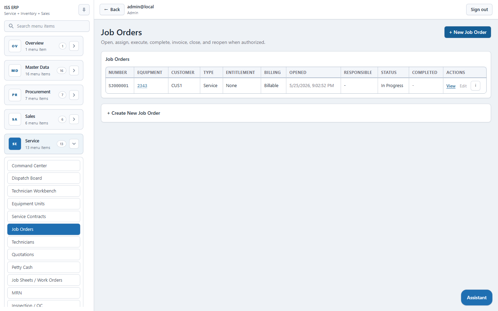
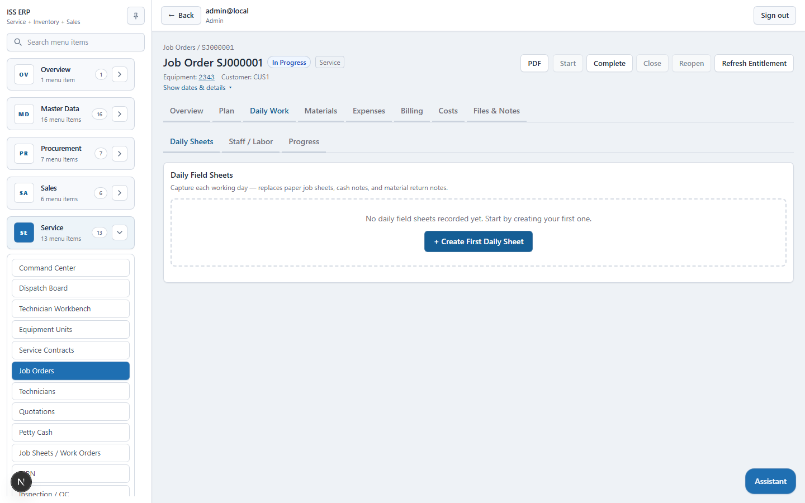
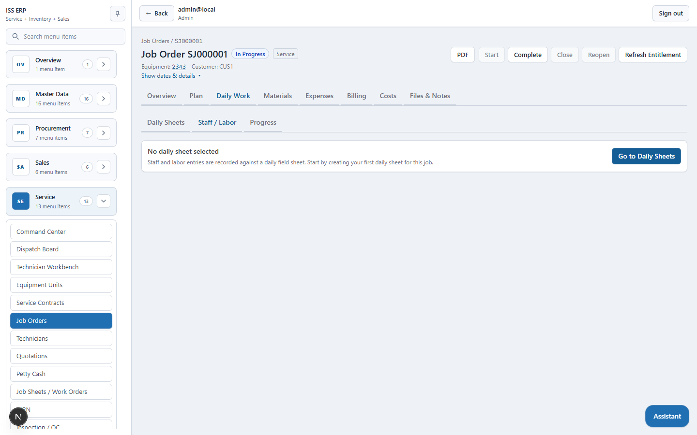
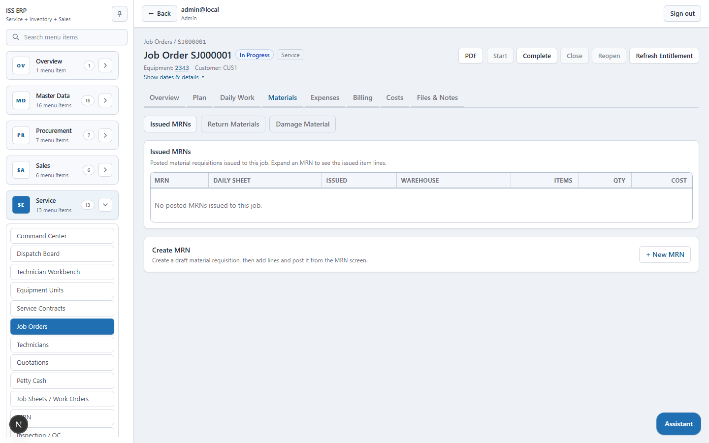

# ISS ERP Full Help Tutorial

This guide is written for a new user, tester, or trainer. It explains the ISS ERP system in simple English and follows the same practical style used when teaching accounting or stock systems such as Tally.

Use this guide to learn:

- what each screen is for
- what to enter
- what output to expect
- what to check after saving, posting, approving, or printing

Screenshots used by this guide are stored in:

- `docs/assets/tester-trainer/`
- `frontend/public/help/system/`
- `frontend/public/help/job-orders/`

## 1. First Login And Screen Layout

Open the system and sign in.

What to input:

| Field | What to enter |
| --- | --- |
| Email | Your user email |
| Password | Your password |

Output:

- The system opens the dashboard.
- The left side menu shows only the modules you can access.
- The top bar shows your signed-in user and notification bell.

What to check:

- You can see the expected modules in the sidebar.
- The notification bell is visible.
- If a menu is missing, ask an admin to check `Admin -> Users -> Access permissions`.

## 2. Main Menu Map

| Menu | Used for |
| --- | --- |
| Overview | Dashboard and quick business summary |
| Master Data | Setup data such as items, customers, suppliers, currencies, warehouses, taxes |
| Procurement | Purchase requisitions, RFQs, purchase orders, receipts, supplier invoices, supplier returns |
| Sales | Quotes, orders, dispatches, direct dispatches, invoices, customer returns |
| Service | Equipment, service jobs, daily sheets, work orders, estimates, handovers |
| Inventory | On-hand stock, availability, reorder alerts, stock adjustments, stock transfers |
| Finance | AR, AP, payments, petty cash, IOUs, credit notes, debit notes |
| Reporting | Stock, aging, tax, service, sales, purchase, supplier, and costing reports |
| Admin | Users, notifications, imports, settings |
| Audit Logs | History of user actions and system changes |

Common rule:

- Use `Create` or `New` to make a document.
- Use `Edit` only while a document is still draft.
- Use `Post`, `Approve`, `Confirm`, or `Send` when the document is ready.
- After posting, check the related output: stock, AR, AP, report, notification, or PDF.

## 3. Master Data Setup

Master data must be correct before transactions are entered.

Recommended setup order:

1. Companies, currencies, and exchange rates
2. Taxes and tax conversions
3. Payment types
4. Warehouses and bins/racks
5. UoMs and unit conversions
6. Item categories and brands
7. Items
8. Suppliers and customers
9. Reorder settings

### 3.1 Currencies

What to input:

| Field | Example |
| --- | --- |
| Code | `LKR`, `USD` |
| Name | `Sri Lankan Rupee` |
| Symbol | `Rs.` |
| Minor units | `2` |
| Base currency | Tick for the main company currency |

Output:

- Currency appears in the currency list.
- Payment, invoice, and reporting screens can use the currency.

What to check:

- Exactly one base currency should be active.
- Exchange rate exists when using a foreign currency.

### 3.2 Items

What to input:

| Field | Example |
| --- | --- |
| SKU | `HF-001` |
| Name | `Hydraulic Filter` |
| Type | Stock, Service, Equipment, or Expense |
| Unit of measure | `PCS` |
| Default unit cost | `2500.00` |
| Tracking type | None, Batch, Serial, or Batch + Serial |

Output:

- Item appears in item lists.
- Item can be selected in purchase, sales, inventory, and service screens.

What to check:

- Stock items must have correct tracking type before transactions begin.
- Equipment items should use serial tracking if each machine has a serial number.

### 3.3 Customers And Suppliers

What to input:

| Field | Customer example | Supplier example |
| --- | --- | --- |
| Code | `CUS001` | `SUP001` |
| Name | `ABC Customer` | `Main Supplier` |
| Email/phone/address | Optional but recommended | Optional but recommended |

Output:

- Customer can be used in sales and service.
- Supplier can be used in procurement and AP.

What to check:

- Codes should not be duplicated.
- Inactive customers or suppliers should not be used for new transactions.

## 4. Procurement Tutorial

Procurement controls the buying cycle.

Main flow:

1. Purchase Requisition
2. RFQ
3. Purchase Order
4. Goods Receipt
5. Supplier Invoice
6. Supplier Payment

### 4.1 Purchase Requisition

Use when a department requests items before purchasing.

What to input:

| Field | Example |
| --- | --- |
| Required date | Expected need date |
| Reason/notes | Why the item is required |
| Item | `Hydraulic Filter` |
| Quantity | `10` |

Output:

- Draft PR is created.
- Lines can be added or edited while draft.

What to check:

- Submit sends the PR for approval.
- Users with `Procurement.PurchaseRequisition.Approve` receive notification.
- Approver can approve or reject.
- Approved PR can be converted to a PO.

### 4.2 RFQ

Use when asking suppliers for prices.

What to input:

| Field | Example |
| --- | --- |
| Supplier | Selected supplier |
| Item | Requested item |
| Quantity | Requested quantity |

Output:

- RFQ document is created.
- `Send` marks it as sent.

What to check:

- RFQ number is generated.
- PDF can be downloaded if needed.

### 4.3 Purchase Order

Use when confirming a purchase from a supplier.

What to input:

| Field | Example |
| --- | --- |
| Supplier | `SUP001` |
| Item | `Hydraulic Filter` |
| Quantity | `10` |
| Unit cost | `2500.00` |
| Tax | Applicable tax |

Output:

- PO total is calculated.
- PO stays draft until approved.

What to check:

- Approve action is available only for users with PO approve permission.
- After approval, PO can be used for GRN.
- Creator receives notification when approved.

### 4.4 Goods Receipt Note

Use when purchased goods arrive.

What to input:

| Field | Example |
| --- | --- |
| PO | Approved PO |
| Warehouse | `MAIN` |
| Received quantity | `10` |
| Cost | Supplier cost |
| Batch/serial | Required if item is tracked |

Output:

- GRN is created.
- Posting increases stock.
- Posting can create AP liability.

What to check:

- Inventory on-hand increased.
- AP entry exists for the supplier.
- Stock ledger/report shows receipt movement.

### 4.5 Supplier Invoice

Use to record supplier billing.

What to input:

| Field | Example |
| --- | --- |
| Supplier | Supplier from PO/GRN |
| Source document | PO, GRN, or direct purchase |
| Invoice date | Supplier invoice date |
| Supplier invoice number | Supplier reference |

Output:

- Supplier invoice is created.
- Posting updates AP.

What to check:

- Supplier AP balance increases.
- Invoice PDF is available.

### 4.6 Supplier Return

Use when returning items to supplier.

What to input:

| Field | Example |
| --- | --- |
| Supplier | Supplier |
| Warehouse | Where stock is returned from |
| Item | Returned item |
| Quantity | Return quantity |
| Reason | Damage, wrong item, excess |

Output:

- Posted return reduces stock.
- Supplier credit note is created.

What to check:

- Stock reduced.
- Supplier credit note appears in finance.

## 5. Inventory Tutorial

Inventory screens show and control stock.

### 5.1 Inventory Availability

Use this to search current stock.

What to input:

| Filter | Example |
| --- | --- |
| Warehouse | `MAIN` |
| Item | `Hydraulic Filter` |
| Batch/serial | Optional |

Output:

- Table shows item, warehouse, bin, batch, serial, quantity, unit cost, and value.

What to check:

- Stock received by GRN appears here.
- Stock sold or issued by MRN is reduced.
- Unassigned bin means stock exists without a bin/rack.

### 5.2 Stock Adjustment

Use when physical count differs from system stock.

What to input:

| Field | Example |
| --- | --- |
| Warehouse | `MAIN` |
| Reason | `Monthly stock count` |
| Item | Item being counted |
| Counted quantity | Actual physical quantity |

Output:

- Draft adjustment is created.
- Posting records only the variance.

What to check:

- On-hand becomes the counted quantity.
- Stock ledger shows adjustment movement.
- Voided drafts do not affect stock.

### 5.3 Stock Transfer

Use when moving stock between warehouses.

What to input:

| Field | Example |
| --- | --- |
| From warehouse | `MAIN` |
| To warehouse | `SERVICE` |
| Item | Item to move |
| Move quantity | Quantity transferred |

Output:

- Draft transfer is created.
- Posting reduces source stock and increases destination stock.

What to check:

- Source warehouse stock decreased.
- Destination warehouse stock increased.
- Batch/serial details are preserved.

## 6. Sales Tutorial

Sales controls quote-to-cash.

Main flow:

1. Quote
2. Sales Order
3. Dispatch or Direct Dispatch
4. Sales Invoice
5. Payment
6. Customer Return if needed

### 6.1 Sales Quote

What to input:

| Field | Example |
| --- | --- |
| Customer | `CUS001` |
| Valid until | Expiry date |
| Item/service | Quoted line |
| Quantity | `4` |
| Unit price | `3500.00` |

Output:

- Quote is created in draft.
- Sending marks it as sent.

What to check:

- Quote total is correct.
- PDF can be downloaded.

### 6.2 Sales Order

What to input:

| Field | Example |
| --- | --- |
| Customer | `CUS001` |
| Item | Sold item |
| Quantity | Ordered quantity |
| Price | Sales price |

Output:

- Draft sales order is created.
- Confirming accepts the order.

What to check:

- Confirmed order can be used for dispatch.
- Users with confirm rights see the confirm action.

### 6.3 Dispatch

Use when delivering goods from stock.

What to input:

| Field | Example |
| --- | --- |
| Sales order | Confirmed order |
| Warehouse | Dispatch warehouse |
| Item | Item to dispatch |
| Quantity | Dispatch quantity |
| Serial/batch | Required if tracked |

Output:

- Posting reduces stock.
- Serialized equipment can create equipment units.

What to check:

- Stock decreases.
- Equipment unit is created for serialized equipment.
- Dispatch PDF is available.

### 6.4 Direct Dispatch

Use for direct delivery/AOD without the normal order flow.

What to input:

| Field | Example |
| --- | --- |
| Customer or service job | Destination/customer context |
| Warehouse | Source warehouse |
| Item | Delivered item |
| Quantity | Delivered quantity |

Output:

- Posted direct dispatch reduces stock.
- Equipment units are created for serialized equipment where applicable.

What to check:

- Stock movement is correct.
- Customer/job link is correct.

### 6.5 Sales Invoice

What to input:

| Field | Example |
| --- | --- |
| Customer | `CUS001` |
| Source | Dispatch, direct dispatch, or manual |
| Item/line | Sales line |
| Quantity and price | Invoice quantity and price |

Output:

- Posting creates AR.

What to check:

- Customer AR balance increases.
- Invoice PDF is available.
- Invoice appears in aging reports.

### 6.6 Customer Return

What to input:

| Field | Example |
| --- | --- |
| Customer | Returning customer |
| Invoice | Optional source invoice |
| Item | Returned item |
| Quantity | Return quantity |
| Reason | Damage, wrong item, warranty, etc. |

Output:

- Posting returns stock.
- Customer credit note is created.

What to check:

- Stock increases.
- Customer credit note appears in finance.

## 7. Finance Tutorial

Finance controls money owed, money payable, payments, petty cash, and notes.

### 7.1 Accounts Receivable

Use `Finance -> Accounts Receivable`.

Output:

- Shows customer invoice balances.
- Shows outstanding amounts.

What to check:

- Posted sales invoices appear here.
- Payments reduce outstanding amounts.
- Customer credit notes reduce receivable balance when allocated.

### 7.2 Accounts Payable

Use `Finance -> Accounts Payable`.

Output:

- Shows supplier invoice/GRN balances.
- Shows outstanding amounts.

What to check:

- Posted supplier invoices or purchase receipts appear here.
- Supplier payments reduce outstanding amounts.
- Supplier credit notes reduce payable balance when allocated.

### 7.3 Payments

What to input:

| Field | Incoming payment | Outgoing payment |
| --- | --- | --- |
| Direction | Incoming | Outgoing |
| Counterparty type | Customer | Supplier |
| Counterparty | Customer | Supplier |
| Payment type | Cash, bank, transfer, etc. | Cash, bank, transfer, etc. |
| Amount | Paid amount | Paid amount |
| Currency/rate | As applicable | As applicable |

Output:

- Payment document is created.
- Allocation action can allocate it to AR or AP.

What to check:

- Payment appears in payment list.
- Allocated amount reduces AR/AP outstanding.
- Payment creator receives notification when another user allocates it.

### 7.4 Credit Notes

What to input:

| Field | Example |
| --- | --- |
| Counterparty type | Customer or Supplier |
| Counterparty | Selected customer/supplier |
| Amount | Credit amount |
| Notes | Reason |

Output:

- Credit note is created.
- Allocation can apply it to AR or AP.

What to check:

- Remaining amount reduces after allocation.
- Allocation appears in the credit note detail.
- Creator receives notification when allocated.

### 7.5 Debit Notes

What to input:

| Field | Example |
| --- | --- |
| Counterparty type | Customer or Supplier |
| Counterparty | Selected counterparty |
| Amount | Additional charge |
| Notes | Reason |

Output:

- Debit note is created.

What to check:

- PDF is available.
- Related counterparty balance/reporting is reviewed.

### 7.6 Petty Cash Funds

What to input:

| Field | Example |
| --- | --- |
| Fund code | `PC-MAIN` |
| Name | `Main Petty Cash` |
| Currency | `LKR` |
| Custodian | Person responsible |
| Opening balance | Starting float |

Output:

- Petty cash fund is created.
- Top-up and adjustment entries can be posted by users with permission.

What to check:

- Balance updates after top-up.
- Balance updates after adjustment.
- Fund creator receives notification when another user updates, tops up, or adjusts the fund.

### 7.7 Petty Cash IOUs

Use IOUs when a user requests an advance.

What to input:

| Field | Example |
| --- | --- |
| Service job | Linked job |
| Requested amount | Advance amount |
| Purpose | Why cash is needed |
| Expected settlement date | Planned settlement date |

Output:

- Draft/submitted IOU is created.
- Users with approve rights receive notification.

What to check:

- Approver can approve or reject.
- Finance can release cash.
- Finance can settle the IOU.
- Requester receives status notifications.

## 8. Service Tutorial

Service manages customer equipment, service jobs, daily work, labour, parts, expenses, estimates, handovers, billing, costs, and closeout.

The main rule is:

**Create one job order for the customer equipment problem. Then record each day, each cost, each material issue, each customer approval, and each closeout action against that job.**

### 8.1 Service Menu Areas

| Screen | Purpose |
| --- | --- |
| Command Center | Supervisor view of active jobs, overdue jobs, missing daily sheets, pending approvals, finance blockers, billing readiness, and closeout blockers |
| Dispatch Board | Lane view for unassigned, assigned/active, waiting, and completed jobs |
| Technician Workbench | Technician daily view for assignments, open daily sheets, and quick actions |
| Equipment Units | Customer-owned machines/equipment that can receive service jobs |
| Service Contracts | AMC, SLA, warranty extension, and coverage information |
| Job Orders | Main service job record |
| Job Sheets / Work Orders | Costed or billable labour time records |
| MRN / Material Requisitions | Stock issue documents for job materials |
| Quotations / Estimates | Customer quotation and change-order process |
| Service Taken / Handovers | Customer confirmation, final handover, and invoice path |
| Quality Checks | Inspection or QC records |

### 8.2 Equipment Units

Use `Service -> Equipment Units` before opening a job.

An equipment unit is one customer-owned machine or unit. It normally stores the item/model, serial number, customer owner, site/location, warranty date, coverage, service interval, and next service date.

What to input:

| Field | Example |
| --- | --- |
| Mode | Existing item or outside equipment |
| Item/model | Generator, compressor, hydraulic machine |
| Serial number | `GEN-001` |
| Customer | Equipment owner |
| Warranty/coverage | Labour, parts, or labour and parts |

Output:

- Equipment becomes selectable when creating a service job.

What to check:

- Serial number is correct and unique.
- Customer ownership is correct.
- Warranty and contract information is correct before opening the job.

### 8.3 Service Contracts

Use contracts for AMC, SLA, or warranty extension coverage.

What to input:

| Field | Example |
| --- | --- |
| Equipment unit | Customer machine |
| Contract type | AMC, SLA, Warranty Extension |
| Coverage | Inspection, Labor, Parts, Labor and Parts |
| Start/end dates | Contract period |

Output:

- Job entitlement can be calculated from the active contract.

What to check:

- Contract period covers the job date.
- Coverage type is correct.
- If contract is added after job creation, click `Refresh Entitlement` on the job.

### 8.4 Service Job List

Use `Service -> Jobs` as the main job register. Existing jobs appear first. Use `+ New Job Order` only when opening a new job.

What to input when creating:

| Field | Example |
| --- | --- |
| Equipment unit | Customer machine |
| Customer | Auto-filled or selected |
| Job type | Service, Repair, PDI, Warranty, Inspection |
| Problem/complaint | Customer complaint |
| Responsible officer | Job owner |
| Expected date | Planned finish/visit date |

Output:

- Job order is created.
- Job number is generated.
- Entitlement is checked from service contract first, then warranty.

What to check:

- Equipment and customer are correct.
- Warranty/contract entitlement is correct.
- Job appears in command center and job list.
- Notifications go to the responsible users where configured.

### 8.5 Job Overview And Tabs

Output:

- Shows job number, status, type, equipment, customer, dates, cockpit, and process timeline.

Job tabs:

| Tab | What users do there |
| --- | --- |
| Overview | Check cockpit summary and process timeline |
| Plan | Plan repair operations or stages |
| Daily Work | Create daily sheets, staff/labour attendance, and progress |
| Materials | Issue MRNs, return materials, and record damage/rejection |
| Expenses | IOUs, petty cash vouchers, and reimbursement claims |
| Billing | Closeout readiness, entitlement, estimates, invoices |
| Costs | Material, labour, expense, revenue, and margin review |
| Files & Notes | Comments, attachments, and support documents |

What to check:

- Use timeline links to go to plan, daily work, materials, expenses, billing, costs, and files.
- Header edit is available only while the job is editable.
- Once job execution starts, operational work should be entered through tabs, not header edit.

### 8.6 Daily Field Sheets

A daily sheet is the daily field record for one job on one working day or site visit.

Use it to answer:

- What was planned today?
- What was completed today?
- What is pending?
- What problem or site condition was found?
- Who worked on this job today?
- Were materials, IOUs, expenses, or progress updates entered for this day?

What to input:

| Field | Example |
| --- | --- |
| Work date | Today or site visit date |
| Prepared by | Supervisor or technician |
| Planned work | What should be done |
| Completed work | What was completed |
| Pending/issues | What remains or blocks the job |
| Site condition | Customer site/workshop condition |
| Notes | Special instructions |

Output:

- Daily sheet card appears.
- Staff, progress, material, IOU, and expense counts appear on the card.
- Sheet can be submitted for supervisor approval.

What to check:

- Create one daily sheet per working day.
- Staff and progress require a daily sheet first.
- Draft or submitted sheets block closeout.
- Approve or reject submitted sheets before closeout.

Daily sheet statuses:

| Status | Meaning |
| --- | --- |
| Draft | Created but not submitted |
| Submitted | Sent for supervisor review |
| Approved | Accepted and locked |
| Rejected | Returned for correction |

### 8.7 Daily Staff / Labour

Daily staff/labour records attendance and daily work allocation for a daily sheet.

Use it to record:

- who attended the job
- what each person did
- normal and overtime hours for daily supervision
- technician/helper notes

What to input:

| Field | Example |
| --- | --- |
| Technician/person | Worker |
| Work date/daily sheet | Selected sheet |
| Hours | Time worked |
| Notes | Work summary |

Output:

- Daily staff entry appears under the daily sheet.
- Daily sheet staff count increases.

What to check:

- This records attendance and supervision.
- It does not by itself create final billable invoice labour.

### 8.8 Daily Sheets Vs Job Sheets / Work Orders

This is the most important service difference.

| Daily Sheet / Daily Staff | Job Sheet / Work Order |
| --- | --- |
| Daily operational record | Billable/costed labour record |
| One per working day or site visit | One or more per job/task depending on labour billing |
| Shows what happened today | Shows work/time used for costing and invoicing |
| Records attendance, progress, issues, materials, IOUs, and expenses for the day | Records technician, date, hours, cost rate, billing rate, approval, and invoice status |
| Helps answer: "What happened today?" | Helps answer: "What labour should be costed or billed?" |
| Does not by itself create final billable labour | Approved billable entries can feed invoices |

Simple example:

1. Technician visits customer today.
2. Create a daily sheet for today's visit.
3. Add the technician under daily staff/labour.
4. Add progress explaining the fault and work done.
5. If 3 hours should be billed or costed, create a job sheet/work-order time entry for those 3 hours.

### 8.9 Work Orders / Job Sheets

Use work orders for billable or costed labour time entries.

What to input:

| Field | Example |
| --- | --- |
| Service job | Related job |
| Technician | Technician |
| Work date | Labour date |
| Hours | Billable/cost hours |
| Cost rate | Internal cost |
| Billing rate | Customer charge |
| Billable | Yes/No |

Output:

- Time entry moves through Draft -> Submitted -> Approved/Rejected -> Invoiced.
- Approved labour appears in job costing.
- Billable approved labour can be invoiced.

What to check:

- Technician rates are correct.
- Warranty or contract coverage is applied where relevant.
- Rejected labour is not billed.
- Uninvoiced billable labour is reviewed before closeout.

### 8.10 Materials / MRN

Use MRNs to issue spare parts or materials from inventory to a job.

What to input:

| Field | Example |
| --- | --- |
| Service job | Related job |
| Warehouse/bin | Source stock location |
| Item | Spare part/material |
| Quantity | Required quantity |
| Batch/serial | Required for tracked items |

Output:

- Draft MRN is created.
- Posting MRN issues stock to the job.

What to check:

- Planning a part does not reduce stock.
- Draft MRN does not reduce stock.
- Posted MRN reduces stock.
- Material cost appears in job costing.
- Returned, damaged, rejected, or unused materials are recorded before closeout.

### 8.11 Material Returns, Damage, And Rejection

Use material disposition when issued items were not fully consumed.

Examples:

- unused part returned to stores
- wrong item issued
- customer rejected a part
- part damaged during job
- supplier/manufacturer issue found

What to check:

- Returned material goes back to stock only through the correct posted return flow.
- Damaged/rejected material remains visible for job review.
- Closeout should not allow unresolved material disposition.

### 8.12 Expenses

Expense types:

| Type | Use when |
| --- | --- |
| IOU / Employee Advance | User needs advance cash before final receipts are ready |
| Petty Cash Voucher | Company petty cash was used |
| Out-of-pocket Claim | Employee paid personally and needs reimbursement |

What to check:

- Submitted IOUs notify all users with approve rights.
- Requester receives status notifications.
- Finance can approve, release, and settle IOUs.
- Finance can approve and settle petty cash and reimbursement claims.
- Pending finance documents remain visible on the job and can block closeout.

### 8.13 Estimates / Quotations

Use estimates when the customer must approve repair value or additional work before the job continues.

Estimate lines can include:

- parts
- labour
- billable expenses

What to check:

- Draft estimate can be edited.
- Sending marks customer approval as pending.
- Customer approval or rejection is recorded.
- If scope changes after approval, use a change order.
- Warranty or contract coverage can make covered lines zero charge.

### 8.14 Service Taken / Handover

Use service taken/handover when the repair or service is handed back to the customer.

What to input:

| Field | Example |
| --- | --- |
| Handover date | Completion date |
| Customer acknowledgement | Customer confirmation |
| Returned items | Items returned to customer |
| Post-service warranty | Warranty months if applicable |
| Notes | Final remarks |

Output:

- Handover record is linked to the job.
- Final invoice path can continue where applicable.

What to check:

- Customer acknowledgement is captured.
- Returned items are recorded.
- Handover status is correct before closing.

### 8.15 Billing And Closeout

Open the Billing tab before closing the job.

What to check:

| Closeout area | What to check |
| --- | --- |
| Daily sheets | No draft or submitted daily sheets remain |
| Labour | No open labour entries remain; approved billable labour is billed or intentionally handled |
| Materials | MRNs are posted/cancelled and issued material is used, returned, damaged, or rejected |
| Expenses/IOUs | Pending advances, vouchers, and claims are cleared |
| Estimate/invoice | Customer approval, handover, and final invoice decision are clear |
| Costs | Materials, labour, claims, and invoice revenue are reviewed |

### 8.16 Costs

Output:

- Shows material cost, labour cost, expense cost, quoted revenue, invoice revenue, and margin view.

What to check:

- Posted MRNs are included.
- Approved labour is included.
- Approved/settled claims are included according to workflow.
- Costs are reviewed before final billing.
- Uninvoiced billable labour is checked before closing.

### 8.17 Recommended End-To-End Service Flow

1. Create or confirm the customer equipment unit.
2. Create or confirm service contract/warranty.
3. Create job order.
4. Review entitlement or click `Refresh Entitlement`.
5. Start the job.
6. Plan operations if needed.
7. Create a daily sheet for the first working day.
8. Add daily staff/labour attendance.
9. Add daily progress.
10. Request IOU or enter expense if needed.
11. Create and post MRN if parts are used.
12. Record material return/damage/rejection if required.
13. Create job sheet/work-order labour for billable/costed hours.
14. Create estimate if customer approval is required.
15. Complete the job when technical work is finished.
16. Create service taken/handover.
17. Review Billing and Costs.
18. Clear closeout blockers.
19. Close the job.

## 9. Reporting Tutorial

Reports are used to check the result of transactions.

| Report | What to check |
| --- | --- |
| Stock Ledger | Every stock receipt, issue, adjustment, transfer |
| Aging | Customer AR and supplier AP outstanding |
| Tax Summary | Taxable sales/purchase totals |
| Service KPIs | Job and service performance |
| Sales Analysis | Customer/item sales totals |
| Purchase Analysis | Supplier/item purchase totals |
| Supplier Performance | Supplier delivery/purchase view |
| Costing | Inventory value and cost |

What to input:

- Date range
- Warehouse, item, customer, supplier, or service filter where available

Output:

- Report table and optional PDF.

What to check:

- Report totals match posted documents.
- Draft documents should not affect posted financial/stock reports.

## 10. Admin, Users, Access, And Notifications

### 10.1 User Roles

Roles are broad access groups:

- Admin
- Procurement
- Inventory
- Sales
- Service
- Finance
- Reporting

### 10.2 User Permissions

Permissions are detailed rights such as:

- View
- Create
- Edit
- Submit
- Approve
- Reject
- Post
- Allocate
- Settle
- Delete/Void where available

What to input:

| Field | Example |
| --- | --- |
| User | Selected user |
| Roles | Sales, Finance, etc. |
| Access permissions | Tick or untick exact permissions |

Output:

- User effective permissions update.
- Sidebar and action buttons follow those permissions.
- Backend still blocks unauthorized actions even if a user manually opens a URL.

What to check:

- View-only users can open pages but cannot create/edit/post.
- Approvers see approval actions.
- Multiple users with the same approve permission receive the same approval notification.

### 10.3 Notifications

Notifications appear in the notification bell and notification pages.

Examples:

- IOU submitted -> all IOU approvers are notified.
- Purchase requisition submitted -> all PR approvers are notified.
- Expense claim submitted -> all claim approvers are notified.
- Document approved/post/allocated -> creator is notified.

What to check:

- Notification title is clear.
- Notification link opens the correct document.
- After reading, notification status changes.

## 11. Audit Logs

Use Audit Logs to check who did what.

What to check:

- Created document
- Edited document
- Posted document
- Approved/rejected action
- User/admin changes

Audit logs are evidence for testing and troubleshooting.

## 12. End-To-End Example: Stock Purchase To Customer Payment

Use this as a complete training exercise.

1. Create or confirm item, supplier, customer, warehouse, tax, and currency.
2. Create purchase order for item quantity `10`.
3. Approve purchase order.
4. Create GRN from PO.
5. Post GRN.
6. Check inventory availability increased by `10`.
7. Create sales order for quantity `4`.
8. Confirm sales order.
9. Create dispatch.
10. Post dispatch.
11. Check stock reduced by `4`.
12. Create sales invoice.
13. Post invoice.
14. Check AR increased.
15. Create incoming customer payment.
16. Allocate payment to AR.
17. Check AR outstanding reduced.
18. Open stock ledger, aging report, and costing report.

What to check at the end:

- Stock: received `10`, dispatched `4`, remaining `6`.
- AR: invoice amount created and payment reduced it.
- Reports: stock ledger, aging, and costing match the documents.
- Audit: user actions are visible.
- PDFs: PO, GRN, dispatch, invoice, payment can be downloaded where available.

## 13. End-To-End Example: Service Job

1. Create or confirm equipment unit.
2. Create job order.
3. Start the job.
4. Create daily sheet.
5. Add daily staff.
6. Add progress update.
7. Request IOU if needed.
8. Create MRN and post material issue.
9. Create work order labour entry.
10. Submit and approve labour.
11. Create estimate if customer approval is needed.
12. Complete job.
13. Create handover/service taken.
14. Review billing and closeout readiness.
15. Review costs.
16. Close job after blockers are cleared.

What to check:

- Daily work exists for every working day.
- Materials and expenses are settled.
- Labour is approved.
- Billing decision is completed.
- Costs are reviewed.
- Job closes only when readiness is clear.

## 14. Testing Checklist For Each Transaction

For every transaction screen, check:

| Check | Pass condition |
| --- | --- |
| Create | Document number is generated |
| Edit | Draft document can be edited |
| Permission | Unauthorized user cannot perform action |
| Submit/Approve/Post | Status changes correctly |
| Notification | Correct users receive notification |
| Inventory impact | Stock changes only after posting |
| Finance impact | AR/AP changes only after posting/allocation |
| PDF | PDF opens/downloads |
| Audit | Action appears in audit log |
| Report | Related report reflects posted result |

## 15. Common Mistakes

| Mistake | Correct action |
| --- | --- |
| Trying to edit posted document | Create return, credit note, debit note, adjustment, or correction flow |
| Expecting draft to affect stock | Post the document first |
| Expecting daily labour to invoice customer | Use work order/job sheet billable time |
| Missing approve button | Check user permission |
| Missing menu item | Check role and view permission |
| No stock available | Check warehouse, bin, batch, serial, and posted receipts |
| Cannot close service job | Open Billing -> Closeout Readiness and clear blockers |

## 16. Quick Trainer Script

Say this to a new user:

1. "First we set master data: items, customers, suppliers, warehouses, taxes, and currency."
2. "Then we create business documents in draft."
3. "Draft documents are safe. They do not affect stock or accounts until posted or approved."
4. "Posting is the important action. It updates stock, AR, AP, reports, and audit."
5. "Permissions control who can view, create, edit, approve, post, allocate, or settle."
6. "Notifications tell the next responsible users what needs action."
7. "Reports are where we check that the transaction result is correct."
