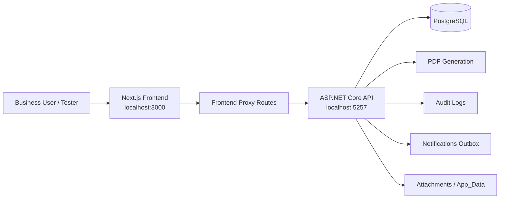
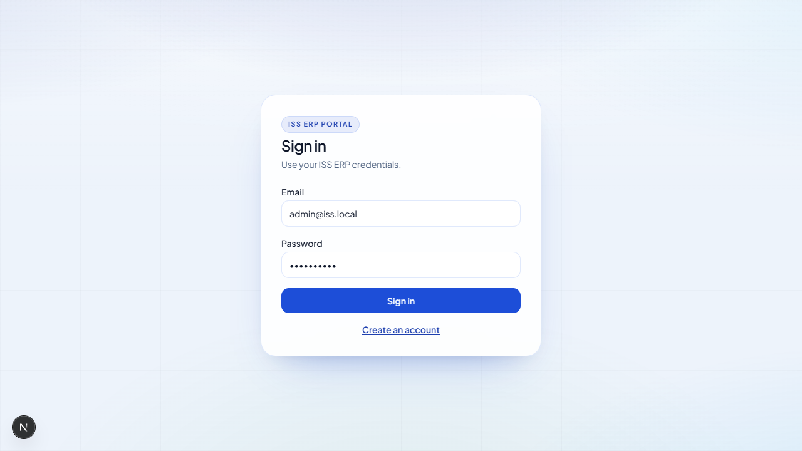
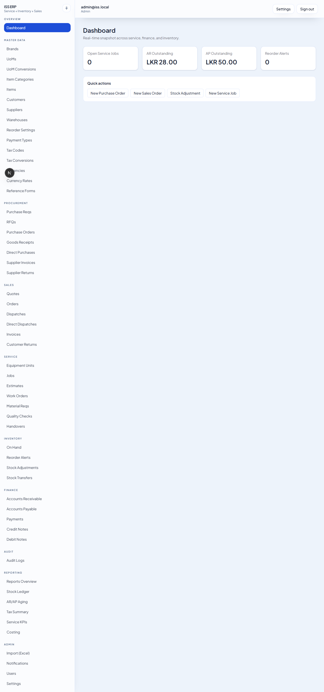
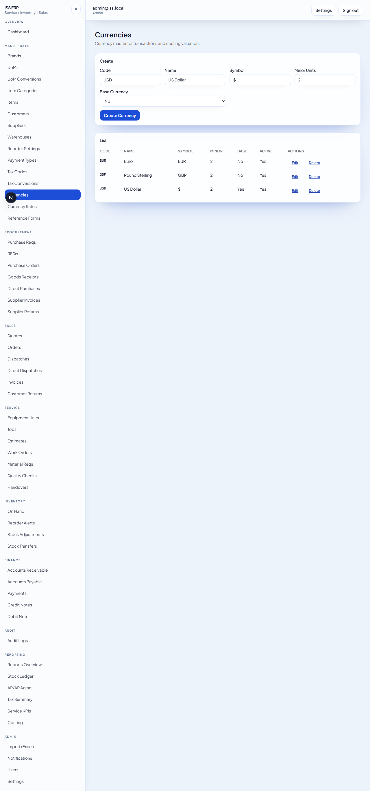
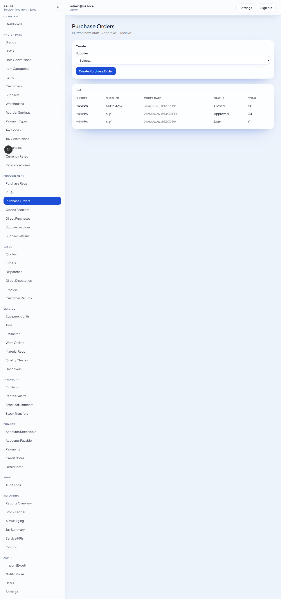
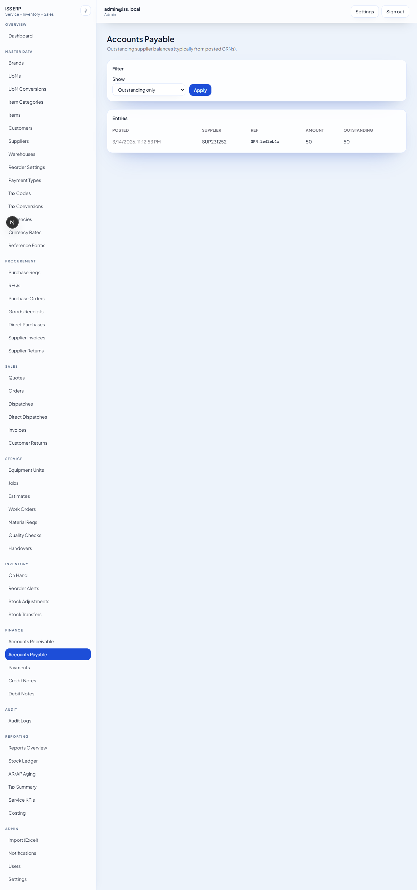
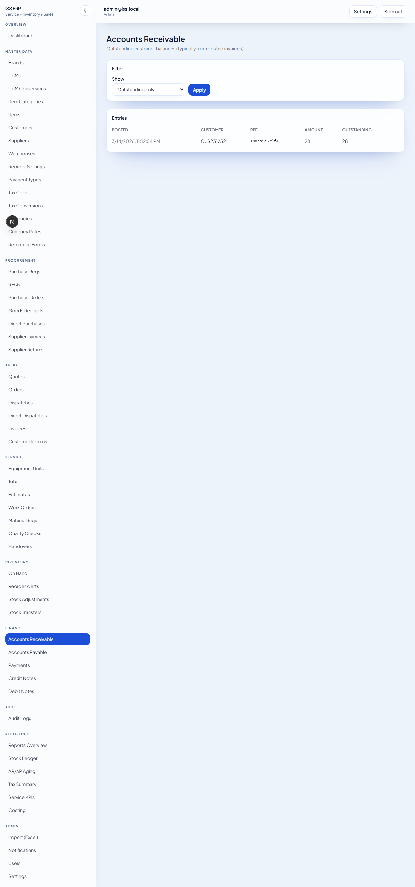
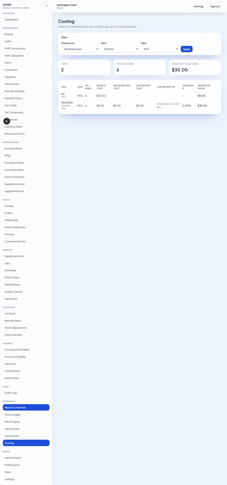
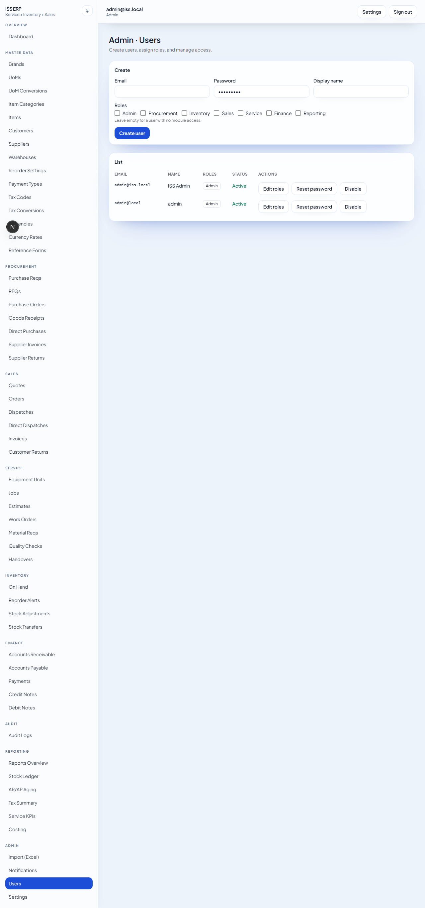

# ISS Tester and Trainer Handbook

This document is the zero-knowledge onboarding guide for manual testers, business users, and trainers working with the ISS ERP system.

It combines the "what is this system?", "how do I run it?", and "how do I test it?" answers into one place.

Validated against the current repository and a live local walkthrough on March 30, 2026.

## 1. What This System Is

ISS is a browser-based ERP system for service, inventory, procurement, sales, finance, and reporting work.

Main business areas:

- Master data
- Procurement
- Inventory
- Sales
- Service
- Finance
- Reporting
- Admin and audit

The system is built with:

- Frontend: Next.js web app
- Backend: ASP.NET Core Web API
- Database: PostgreSQL
- Supporting services: PDF generation, document attachments, audit logging, notifications

## 2. Who Should Use This Guide

Use this guide if you are:

- a new tester who has never used an ERP before
- a trainer preparing a demo or user onboarding session
- a business user validating that a change still works
- a project lead who needs a repeatable UAT script

Use the deeper technical docs only when you need implementation detail:

- `docs/manual-uat-guide.md`
- `docs/user-manual.md`
- `docs/system-technical-maintainer-guide.md`
- `docs/backend-architecture.md`
- `docs/frontend-architecture.md`

## 3. Basic ERP Concepts

If the trainee is completely new, teach these first:

| Term | Meaning in ISS |
| --- | --- |
| Master data | Reference data used by transactions, such as items, suppliers, customers, warehouses, taxes, currencies |
| Transaction | A business document such as a PO, GRN, invoice, payment, stock adjustment, or work order |
| Draft | A document that can still be edited |
| Posted | A document that has created business impact, such as stock movement or AR/AP |
| AR | Accounts receivable, meaning money customers owe you |
| AP | Accounts payable, meaning money you owe suppliers |
| On hand | Current physical stock quantity |
| Costing | Inventory value based on default and weighted average cost |
| Audit log | History of changes and actions in the system |
| PDF output | Downloadable printable version of a business document |

Common status meanings:

| Status | Meaning |
| --- | --- |
| Draft | Being prepared |
| Approved / Confirmed | Accepted for the next stage |
| Sent | Shared with the outside party |
| Posted | Financial or inventory effect applied |
| Paid | Invoice fully settled |
| Completed / Closed | Service flow finished |
| Void / Cancelled | Stopped and no longer active |

## 4. System Overview



What this means in practice:

- users work entirely in the browser
- the frontend sends requests to the backend API
- the backend saves business data in PostgreSQL
- posted transactions update stock, AR/AP, reports, audit history, and PDFs

## 5. Functional Map

| Menu area | Purpose | Examples of what to test |
| --- | --- | --- |
| Dashboard | High-level KPIs | AR/AP totals, reorder alerts, service jobs |
| Master Data | Core setup records | currencies, items, warehouses, suppliers, customers |
| Procurement | Buying and receiving | PR, RFQ, PO, GRN, supplier invoice, supplier return |
| Inventory | Stock control | on hand by warehouse/batch, reorder alerts, stock adjustment count entry, stock transfer move entry |
| Sales | Selling and dispatching | quotes, orders, dispatches, invoices, customer returns |
| Service | Workshop and after-sales work | jobs, estimates, expense claims, work orders, QC, handovers, job costing |
| Finance | Money owed and paid | AR, AP, payments, petty cash funds, credit notes, debit notes, expense-claim approval/settlement |
| Reporting | Operational visibility | stock ledger, aging, tax summary, service KPIs, costing |
| Admin | Control and support tools | users, notifications, Excel import, settings |
| Audit Logs | Change tracking | posted actions and entity changes |

## 6. Local Setup For Testing

From the repo root:

### Database

Expected:

- PostgreSQL is available on `localhost:5432`
- Main local database: `iss`
- Local integration-test database: `iss_integration_local`
- Default local credentials used in this repo: `pgadmin / vesper`

### Backend

```powershell
dotnet run --project backend/src/ISS.Api/ISS.Api.csproj
```

Expected:

- API starts on `http://localhost:5257`
- `http://localhost:5257/health` returns `Healthy`

### Frontend

```powershell
cd frontend
copy .env.example .env.local
npm install
npm run dev
```

Expected:

- app loads on `http://localhost:3000`

### Login and roles

- In a fresh system, the first registered user becomes `Admin`
- Existing role names are:
  - `Admin`
  - `Procurement`
  - `Inventory`
  - `Sales`
  - `Service`
  - `Finance`
  - `Reporting`

Trainer note:

- for local demos, always use an account with `Admin` access so every screen is visible

## 7. Recommended Training Sequence

Train new testers in this order:

1. Explain the module map and the meaning of `Draft`, `Posted`, `AR`, `AP`, and `On Hand`.
2. Show login, sidebar navigation, the sidebar search box, and the dashboard.
3. Run the smoke test.
4. Run one full end-to-end business scenario.
5. Teach the tester how to collect evidence:
   - screenshot
   - document number
   - expected value
   - actual value
   - page URL
6. Move to the full module regression checklist.

The best first full scenario is:

- create master data
- receive stock through procurement
- sell the stock
- create AR/AP entries
- validate reports

## 8. Smoke Test

Use this for every build or release candidate.

### Smoke steps

1. Open `Master Data -> Currencies`.
2. Open `Finance -> Payments`.
3. Open `Reporting -> Costing`.
4. Open `Admin -> Users`.
5. Open `Audit Logs`.

### Expected results

- currencies page loads and base currency exists
- payments page loads without currency errors
- costing page loads successfully
- users page loads for admin users
- audit log page opens without errors

If these five fail, stop deeper testing and fix the environment first.

## 9. Core End-To-End Scenario

This is the main business walkthrough a new tester should learn first.

It follows a simple stock-in -> sell -> finance -> reporting path.

### Scenario summary

| Step | Business meaning | Expected business effect |
| --- | --- | --- |
| Create master data | Create the records the system depends on | Records are saved and selectable |
| Create PO and GRN | Buy and receive stock | On hand increases and AP is created |
| Create direct dispatch and invoice | Sell stock to a customer | On hand decreases and AR is created |
| Review finance pages | Confirm money owed | AR and AP show correct balances |
| Review costing | Confirm stock valuation | On hand and value match transaction history |

### Suggested test values

Use the same values every time so results are easy to compare.

| Type | Value |
| --- | --- |
| Warehouse | `MAIN` |
| Supplier | `SUP1` |
| Customer | `CUS1` |
| Item | `SKU1 - Hydraulic Filter` |
| Receipt quantity | `10` |
| Receipt unit cost | `5` |
| Sales quantity | `4` |
| Sales unit price | `7` |

### Step A: Create core master data

Create:

- one warehouse
- one supplier
- one customer
- one item with UoM `PCS` and default cost `5`

Expected:

- each record saves without error
- each record appears in its list page

Evidence to capture:

- screenshot of the saved row
- code or SKU used

### Step B: Procurement receipt

1. Create a purchase order for the supplier.
2. Add one line for the item:
   - quantity `10`
   - unit price `5`
3. Approve the PO.
4. Create a goods receipt from the PO.
5. Confirm the `Receive From PO` table loads all open PO lines automatically.
6. Enter the actual received quantity only for the lines delivered now:
   - leave `0` or blank on lines that have not arrived yet
   - for serial-tracked items, the serial count must exactly match the quantity on that same row
7. Save the receipt plan and confirm the `Current Draft Lines` table shows the lines added to this GRN.
8. Post the GRN.

Expected:

- PO total is `50`
- GRN posts successfully
- If only part of the PO is received, the PO remains open for another GRN later
- AP shows an outstanding supplier balance of `50`
- On Hand becomes `10`

### Step C: Sales issue and invoice

1. Create a direct dispatch for the customer and warehouse.
2. Add one line:
   - quantity `4`
3. Post the direct dispatch.
4. Create a sales invoice for the same customer.
5. Add one line:
   - quantity `4`
   - unit price `7`
   - discount `0`
   - tax `0`
6. Post the invoice.

Expected:

- stock drops from `10` to `6`
- invoice total is `28`
- AR shows an outstanding customer balance of `28`

### Step D: Reporting validation

Open:

- `Finance -> AP`
- `Finance -> AR`
- `Reporting -> Costing`

Expected:

- AP outstanding = `50`
- AR outstanding = `28`
- costing shows:
  - on hand = `6`
  - default cost = `5`
  - weighted average cost = `5`
  - inventory value = `30`

### Step E: Optional payment test

If time allows, continue:

1. Create an incoming payment for the customer for `28`
2. Allocate the payment to the invoice

Expected:

- payment remaining becomes `0`
- AR outstanding becomes `0`
- invoice status changes to `Paid`

## 10. Full Regression Checklist

Use this after the smoke test and core scenario.

### Navigation and security

- login works with valid credentials
- invalid login shows a clear error
- sign out returns to login
- non-admin users only see pages allowed by their role

### Master data

- create, edit, save, cancel, and delete work on list pages
- blocked deletes show a useful message when a record is in use
- inactive records behave correctly in dropdowns and lists
- seeded reference data exists on a clean system:
  - currencies
  - payment types
  - tax codes
  - reference forms

### Procurement

- RFQ create -> add lines -> send
- purchase requisition create -> submit -> approve
- approved PR converts to PO
- PO create -> add lines -> approve
- GRN create from PO -> add lines -> post
- direct purchase posts stock correctly
- supplier invoice posts AP correctly
- supplier return reduces stock and adjusts supplier balance
- PDFs open and document numbers match the screen

### Inventory

- on hand query returns the expected quantity and correct warehouse/batch split
- stock adjustment draft lines can be add/edit/delete before posting
- stock adjustment posts counted quantity as signed variance in stock history
- stock transfer create/post works across warehouses using move quantity
- reorder alerts reflect reorder settings
- reorder alerts can create a PR draft

### Sales

- quote create -> add lines -> send
- sales order create -> add lines -> confirm
- dispatch create -> add lines -> post
- direct dispatch posts stock correctly
- invoice post creates AR correctly
- customer return increases stock and adjusts customer balance
- PDFs open and totals match the screen

### Service

- equipment unit can be registered
- service job can be created and status changed
- work order can be created
- estimate can be created, lined, revised, and approved or sent
- billable approved expense-claim lines can be converted into a draft estimate or auto-created estimate revision
- material requisition can be posted
- quality check can be recorded
- handover can be completed and converted to invoice
- service job detail shows material, direct-purchase, and expense-claim cost rollup

### Finance

- AR page shows open invoice balances
- AP page shows open supplier balances
- payment create and allocation work
- petty cash fund create, top-up, adjustment, and expense-claim settlement work
- credit note and debit note flows work
- payment PDF opens and matches the screen

### Reporting

- dashboard shows current KPI totals
- stock ledger reflects inventory movements
- aging groups balances correctly
- tax summary loads and shows totals
- service KPI page loads
- costing matches item movement history

### Admin and support

- admin can create users and assign roles
- password reset works
- notifications page loads and retry action works when needed
- Excel import template downloads and upload validates correctly
- audit logs show business activity after posting

## 11. Evidence Rules For Testers

Every defect report should include:

- module and page
- exact steps
- sample data used
- expected result
- actual result
- one screenshot
- document number or record code
- date and time

Recommended defect template:

```text
Title:
Module/Page:
Environment:
Role used:
Test data:
Steps to reproduce:
Expected result:
Actual result:
Evidence:
Severity:
```

## 12. Trainer Guidance

When training a new tester:

- explain the business purpose before the button clicks
- ask the tester what should change after posting a document
- make them predict AR/AP/on-hand before opening the report page
- keep one repeatable dataset per training session
- teach them to verify both the transaction page and the downstream effect

A trainee is ready to test independently when they can explain:

- why master data is needed before transactions
- what posting changes
- how procurement affects stock and AP
- how sales affects stock and AR
- how reports prove the transactions were applied correctly

## 13. Screenshots

These screenshots were captured from a live local walkthrough on March 14, 2026.

### Figure 1: Login screen



The login page also supports account creation when self-registration is enabled.

### Figure 2: Dashboard after sample walkthrough



In the captured example, the dashboard shows:

- AR outstanding `LKR 28.00`
- AP outstanding `LKR 50.00`
- reorder alerts `0`

### Figure 3: Seeded currency master data



This is a good smoke-test page because fresh systems should already have default currencies.

### Figure 4: Purchase order list and create area



Use this screen to teach the difference between a draft transaction and an approved document.

### Figure 5: Accounts payable showing GRN-driven liability



In the captured example, supplier `SUP231252` has an outstanding GRN balance of `50`.

### Figure 6: Accounts receivable showing invoice-driven balance



In the captured example, customer `CUS231252` has an outstanding invoice balance of `28`.

### Figure 7: Costing report showing valuation after stock in and stock out



In the captured example, item `SKU231252` shows:

- on hand `6`
- weighted average cost `5`
- inventory value `30`

### Figure 8: Admin user management



Use this screen to train admins on role assignment and account support tasks.

## 14. Current Operator Notes

Focus on these checks during training and regression:

- verify the transaction page and the downstream effect
- use the On Hand breakdown views when warehouse or batch matters
- for stock adjustments, confirm the entered counted quantity and the posted variance are both correct
- for stock transfers, confirm the move quantity reduced the source warehouse and increased the destination warehouse
- use stock ledger when a tester needs line-by-line movement history

## 15. Best Supporting Documents

Use this handbook first, then move to these documents when needed:

- `README.md` for local startup and test commands
- `docs/role-based-test-checklists.md` for role-by-role UAT and training checks
- `docs/manual-uat-guide.md` for the shorter core UAT path
- `docs/user-manual.md` for module-by-module functional notes
- `docs/system-technical-maintainer-guide.md` for system navigation
- `docs/backend-architecture.md` for backend behavior and operations
- `docs/frontend-architecture.md` for frontend behavior and UI structure
