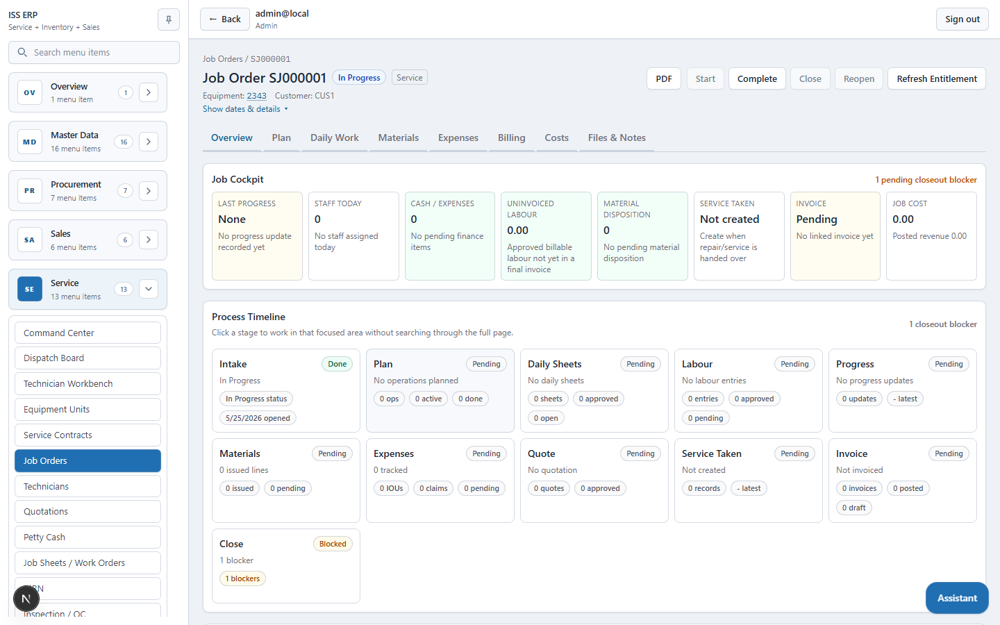
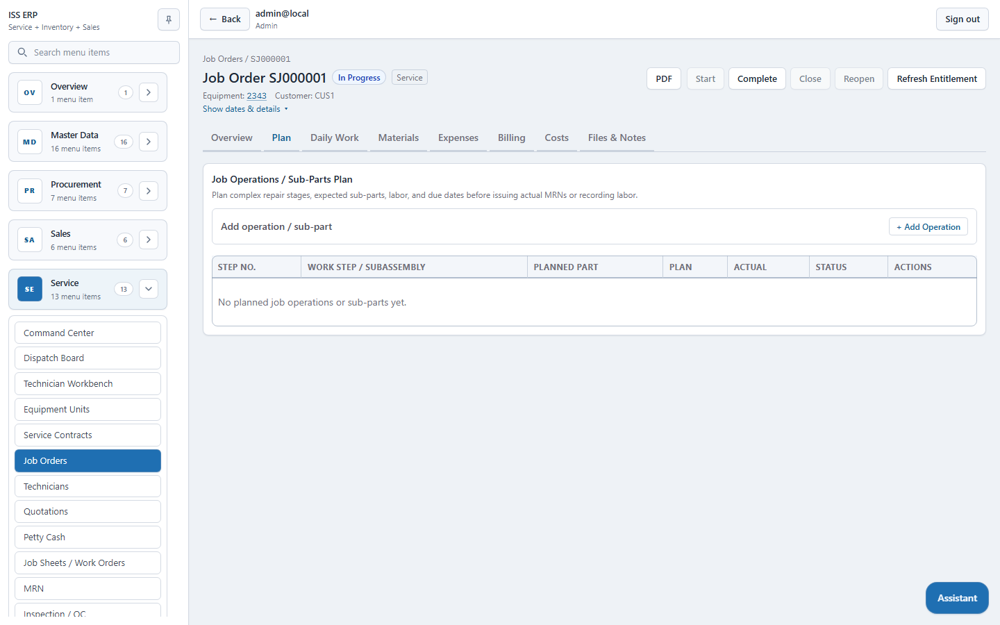
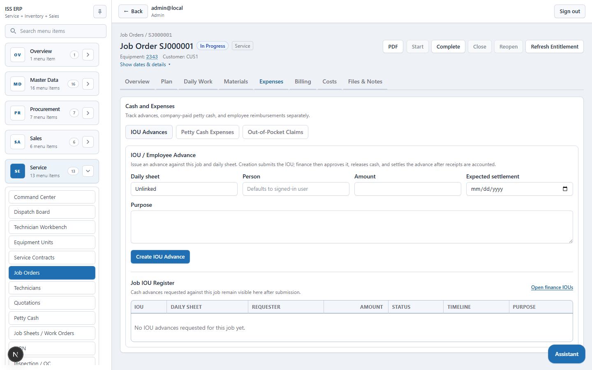
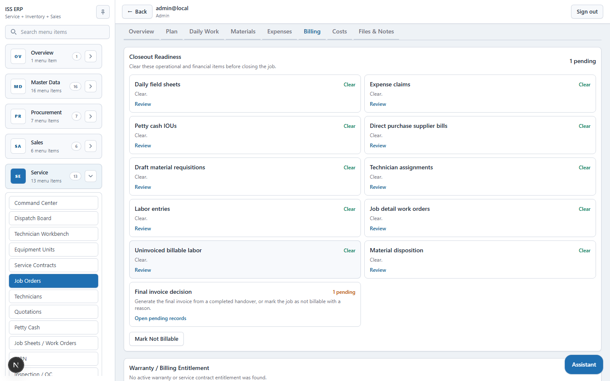
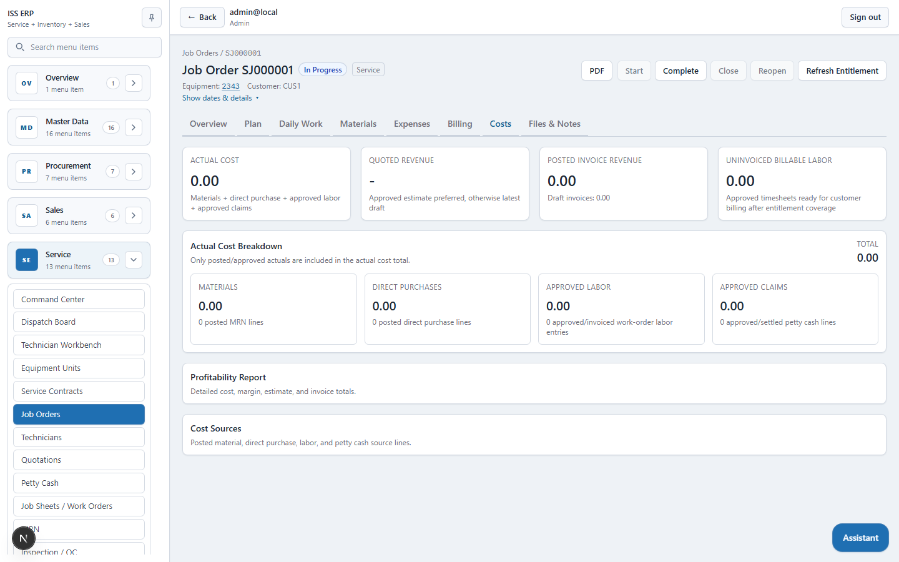
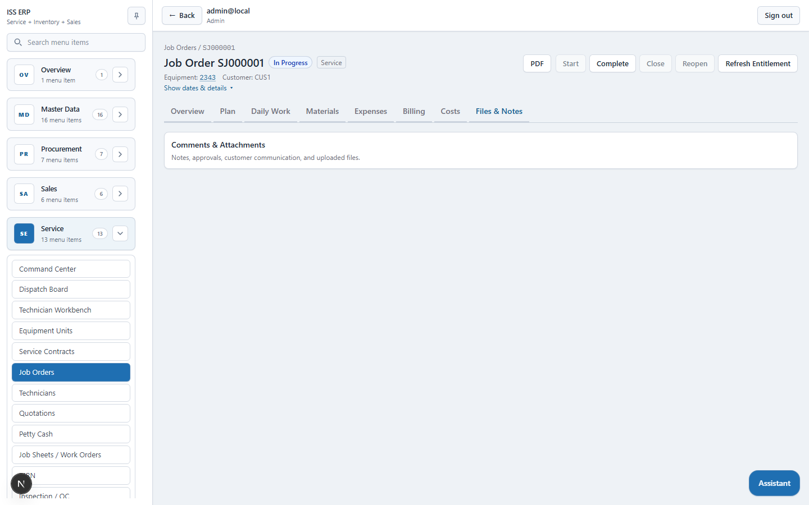

# Job Orders User Manual

This manual explains how to use the `Service -> Jobs` section for service, repair, PDI, warranty, and inspection jobs.

The job screen is designed around one rule: the first view should show the current records, status, and next working area. Create and edit forms open in modal dialogs so users do not lose the page context.

## 1. Open The Job Orders List

Go to `Service -> Job Orders`.

The list is the main working screen for existing jobs.

- Click the job number or `View` to open the full job detail page.
- Click `+ New Job Order` to create a new job in a modal dialog.
- Click `Edit` on an editable job to open the job header edit modal directly from the list.
- Jobs can normally be edited while they are `Draft`, `Open`, or `Reopened`.
- Once job execution has started, header editing is locked and the work should continue through daily sheets, materials, expenses, work orders, handover, and billing.

## 2. Create A New Job Order

From the list, click `+ New Job Order`.

Enter the job intake details:

- Equipment unit
- Customer
- Job type: `Service`, `Repair`, `PDI`, `Warranty`, or `Inspection`
- Site and responsible officer
- Customer complaint / service requirement
- Internal notes where required

The system checks service contract and warranty entitlement when the job is created. If warranty or contract data is added later, use `Refresh Entitlement` from the job detail page.

## 3. Review The Job Overview

Open a job to see the compact job header, cockpit, and process timeline.

The overview shows:

- Job status and type
- Equipment and customer
- Workflow action buttons such as `Start`, `Complete`, `Close`, `Reopen`, and `Refresh Entitlement`
- Job Cockpit metrics
- Process Timeline from intake through closeout

Use the process timeline cards to jump to the relevant working tab.

## 4. Edit A Job Header

There are two edit entry points:

- From `Service -> Job Orders`, click `Edit` in the row.
- From the job detail `Overview`, click `Edit Job`.

Both open the same edit modal. Use it to update the intake/header fields while the job is still editable.

Do not use header editing to change execution records after work starts. Use the relevant job tabs instead.

## 5. Plan Job Operations

Open the `Plan` tab.

Use this tab to define repair stages, sub-parts, planned work, planned parts, labour estimates, and due dates.

- The operations table stays visible first.
- Click `+ Add Operation` to open the add form in a modal dialog.
- Planned parts do not reduce stock.
- Actual material usage is recorded through MRNs in the `Materials` tab.

## 6. Create Daily Field Sheets

Open `Daily Work -> Daily Sheets`.

Daily field sheets replace manual daily job cards. Create one sheet for each working day.

Each sheet tracks:

- Planned work
- Completed work
- Pending/issues
- Site/weather condition
- Staff count
- Progress count
- MRN/material count
- Return/damage count
- Expense and IOU count
- Approval status

If no sheet exists, click `+ Create First Daily Sheet`.

## 7. Record Staff And Labour

Open `Daily Work -> Staff / Labor`.

Use this area for daily attendance and labour assignments linked to a daily sheet.

Important distinction:

- `Daily Staff / Labor` records who attended and what they did that day.
- Billable labour and customer invoicing are handled through job sheets/work orders and approved time entries.

If no daily sheet is selected, the screen shows a `Go to Daily Sheets` action instead of a disabled form.

## 8. Record Progress Updates

Open `Daily Work -> Progress`.

Progress updates are recorded against a daily field sheet. Review existing progress first, then click `+ Add Progress` to add a new update.

Capture:

- Work completed
- Work pending
- Problems found
- Additional parts required
- Additional labour required
- Customer instructions
- Site issues
- Technician and supervisor notes

## 9. Issue And Track Materials

Open the `Materials` tab.

Material workflows are split into:

- `Issued MRNs`
- `Return Materials`
- `Damage Material`

Use `+ New MRN` to create a material requisition for the job. Add lines and post the MRN from the material requisition document. Posted MRNs appear back on the job under `Issued MRNs`.

Use return/damage drafts to dispose of issued material that was unused, wrongly issued, rejected, or damaged.

## 10. Record IOUs And Expenses

Open the `Expenses` tab.

Expense workflows are separated:

- `IOU Advances`
- `Petty Cash Expenses`
- `Out-of-Pocket Claims`

### IOU Advances

Use `+ Request IOU` when a user needs a cash advance for a job.

- The requester is the signed-in system user.
- The IOU is submitted for finance approval.
- The job IOU register remains visible after the request is sent.
- Finance later approves, releases, rejects, cancels, or settles the IOU.

### Petty Cash Expenses

Use `+ Petty Cash Voucher` for company petty-cash spending.

Capture:

- Daily sheet
- Voucher date
- Merchant/vendor
- Bill number issued by the accountant
- Payment handover method: cash handover, bank deposit, or other

### Out-Of-Pocket Claims

Use `+ Reimbursement Claim` when a staff member personally paid an expense and needs reimbursement.

The created claim remains visible in the job expense register and follows the finance approval/settlement process.

## 11. Billing And Closeout

Open the `Billing` tab.

Billing contains:

- Closeout readiness
- Warranty/billing entitlement
- Quotations and final invoices

Closeout readiness shows what must be cleared before closing the job, such as:

- Draft or submitted daily sheets
- Pending IOUs
- Pending expense claims
- Draft MRNs
- Open labour entries
- Material disposition
- Final invoice decision

## 12. Review Costs

Open the `Costs` tab.

The cost view summarizes:

- Actual cost
- Quoted revenue
- Posted invoice revenue
- Uninvoiced billable labour
- Material cost
- Direct purchases
- Approved labour
- Approved claims

Use this tab to check job profitability and cost sources before billing or closing.

## 13. Files And Notes

Open `Files & Notes`.

Use this tab for comments, approvals, customer communication, and attachments linked to the job.

## Recommended Job Flow

1. Open the job immediately when equipment or a service request is received.
2. Create daily field sheets for each work day.
3. Record staff, progress, materials, IOUs, and expenses against the daily sheet.
4. Approve daily sheets when the day is complete.
5. Review materials and make return/damage dispositions.
6. Complete the job when work is finished.
7. Review billing entitlement, quotations, service taken, and invoices.
8. Clear closeout blockers.
9. Close the job.

## Common Issues

| Issue | What To Check |
| --- | --- |
| Cannot edit job header | Job may already be started, completed, invoiced, closed, or cancelled. |
| Cannot add labour/progress | Create or select a daily field sheet first. |
| Job cannot close | Open `Billing -> Closeout Readiness` and clear the pending blockers. |
| IOU request does not disappear | This is expected. It remains visible in the job IOU register with its finance status. |
| MRN material not shown | Confirm the material requisition was posted. Draft MRNs do not consume stock. |
| Expense claim total is zero | Open the expense claim detail and add claim lines. |
